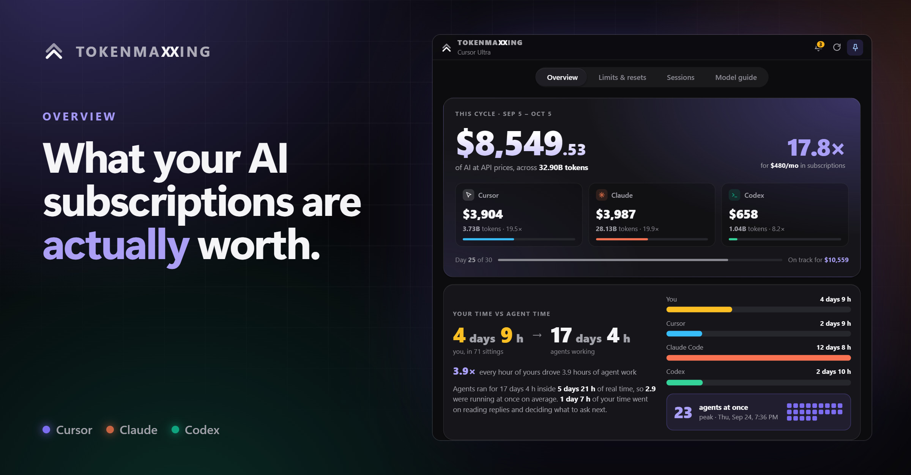
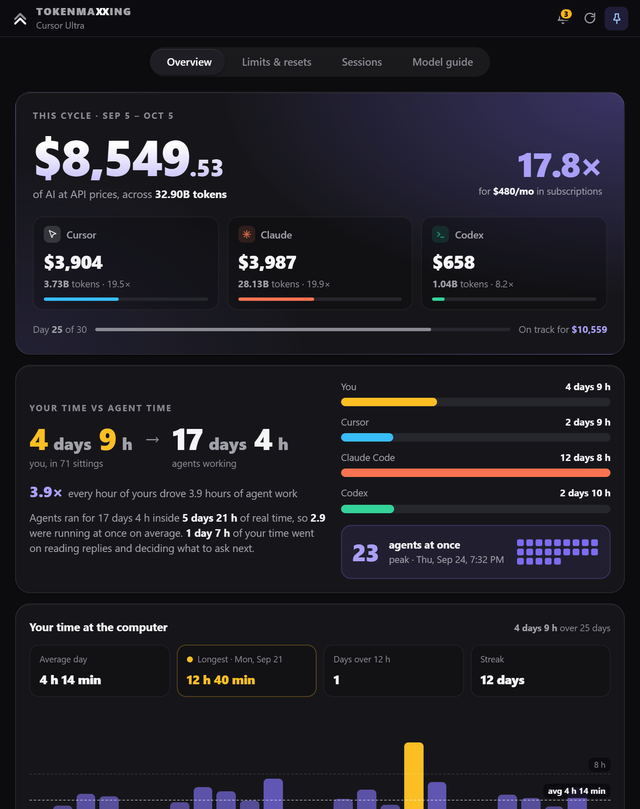
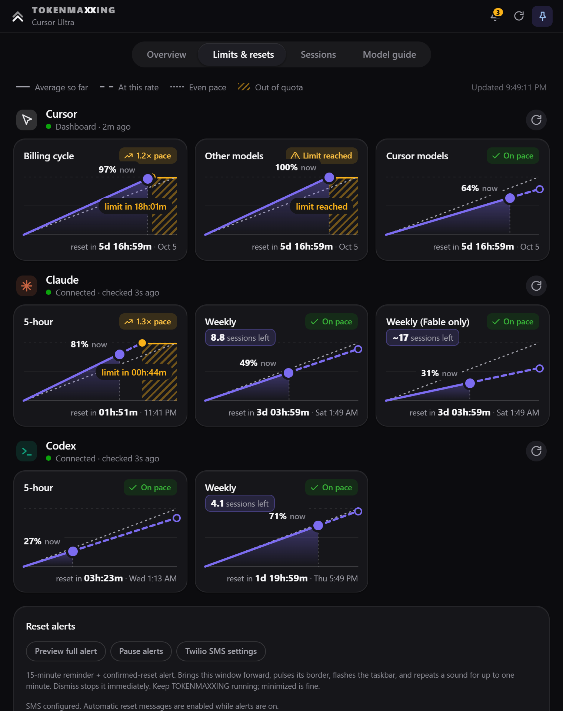
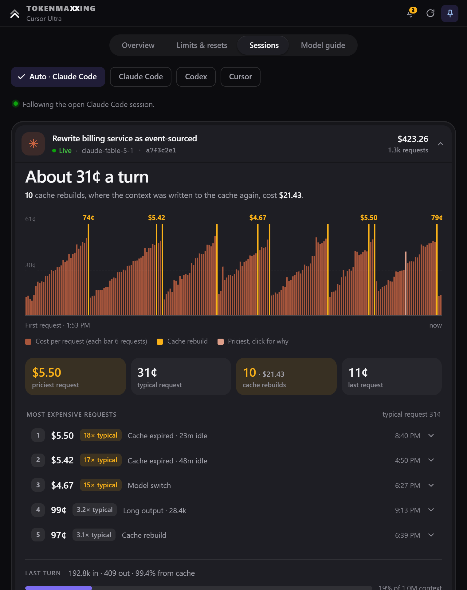
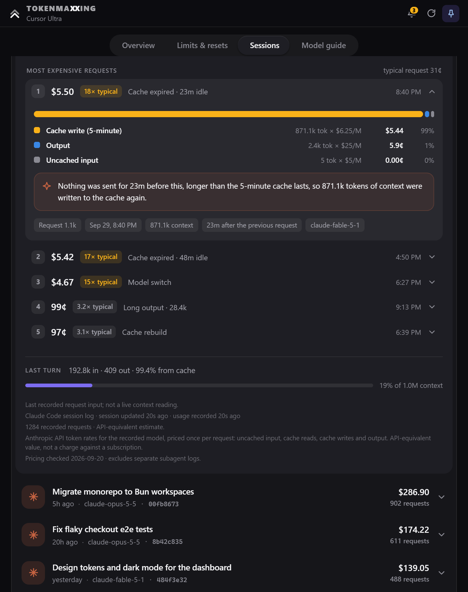
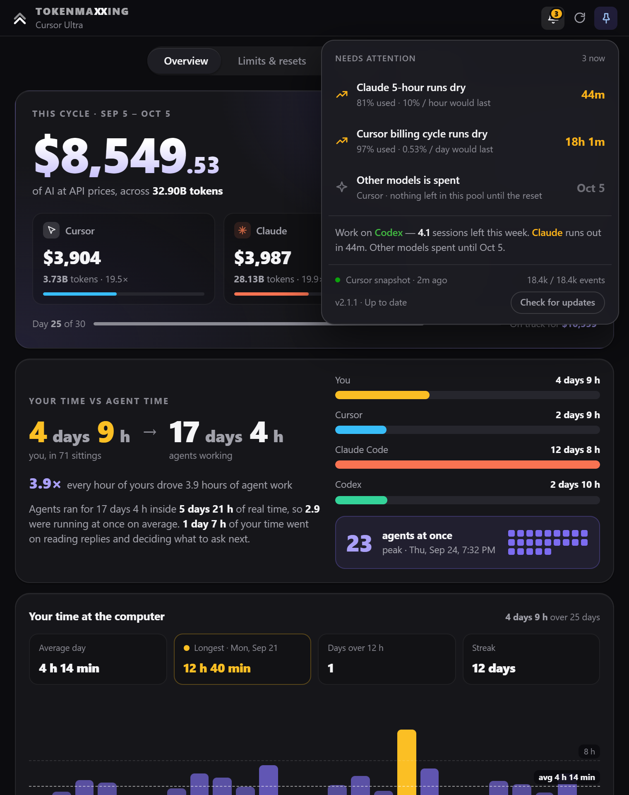
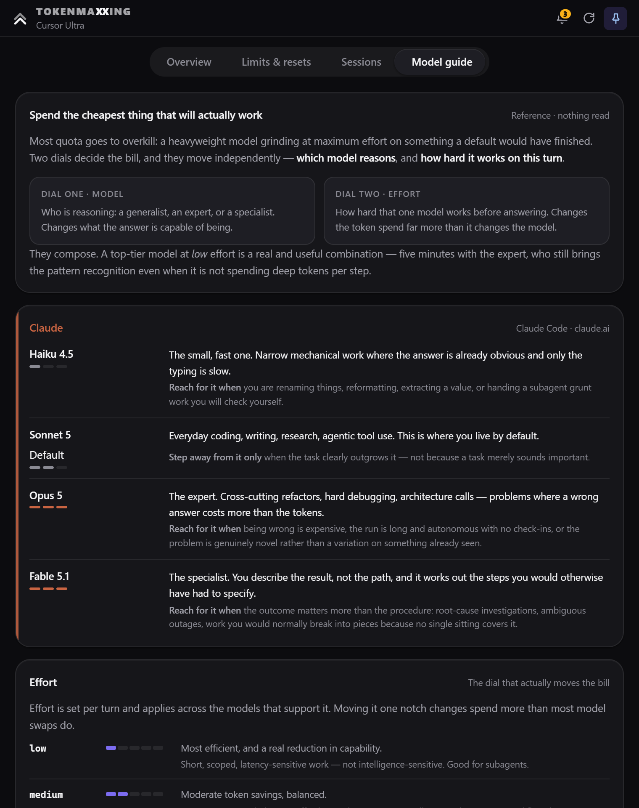
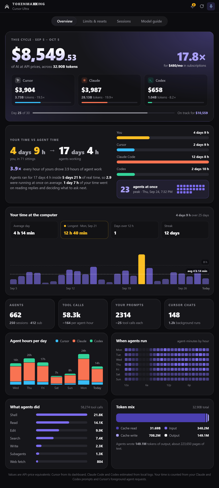

<div align="center">

# TOKENMAXXING

**One always-on-top window for your Cursor, Claude and Codex usage.**<br>
See what your AI subscriptions are actually worth, when each quota runs dry, and what every request cost.

[](https://github.com/aaltaay/TokenMaxxing/releases/latest)
[](LICENSE)




</div>

---

## Why TOKENMAXXING

You pay a flat monthly price for Cursor, Claude and Codex, and each one meters you differently: billing cycles, 5-hour windows, weekly caps, request pools. Quota that resets unused is quota you paid for and never got. Quota that runs out mid-task stops your work.

TOKENMAXXING reads the usage each provider already reports, puts all of it in one small window that stays on top of your editor, and answers three questions at a glance:

- **What am I getting for what I pay?** Your cycle's usage priced at API rates, against your subscriptions.
- **Will I run dry before the reset?** Every window charted against an even pace, with the moment it runs out.
- **Where did the money go?** Every Claude Code and Codex request priced, with the expensive ones explained.

Everything runs on your machine. No account, no server, no telemetry.

## A tour

<table>
<tr>
<td width="50%" valign="middle">

### Overview

The whole cycle at a glance. What your usage is worth at API prices, split by provider, and the multiple against what you pay each month. Below it: how many hours of agent work each hour of yours drove, your time at the computer, and what your agents actually did.

</td>
<td width="50%"></td>
</tr>
<tr>
<td width="50%"></td>
<td width="50%" valign="middle">

### Limits & resets

Every quota window from every provider, one chart each. The solid line is your average so far, the dashed line is where that rate lands, and the dotted line is the even pace that would use exactly 100% at the reset. If you are going to run out early, the chart shades the time you'd be locked out and tells you when.

Weekly Claude and Codex windows also show how many full 5-hour sessions the rest of the week holds, measured from your own readings.

</td>
</tr>
<tr>
<td width="50%" valign="middle">

### Sessions

Follows the Claude Code or Codex chat you have open and prices every request at published API rates. A bar per request shows how cost climbs as the context grows, and where the cache had to be rebuilt.

</td>
<td width="50%"></td>
</tr>
<tr>
<td width="50%"></td>
<td width="50%" valign="middle">

### Why was that request so expensive?

Open any of the priciest requests to see where its cost went (cache writes, cache reads, output, uncached input) and a plain-English reason: a cache that expired after an idle break, a model switch, a compaction, or a very long reply.

</td>
</tr>
<tr>
<td width="50%" valign="middle">

### Notifications

The bell collects what needs attention, soonest first: windows that will run dry, pools that are already spent, and where you still have room to work. Reset alerts bring the window forward 15 minutes before a reset and again when it happens, and can text you through your own Twilio account.

</td>
<td width="50%"></td>
</tr>
<tr>
<td width="50%"></td>
<td width="50%" valign="middle">

### Model guide

A built-in field guide to spending less: which Claude, Codex and Cursor model to reach for, what each effort level actually buys, and the habits that save the most quota.

</td>
</tr>
</table>

<details>
<summary><b>See the full Overview</b></summary>
<br>
<div align="center"></div>
</details>

## Get started

### Install on Windows

1. Download the latest installer from **[GitHub Releases](https://github.com/aaltaay/TokenMaxxing/releases/latest)**.
2. Run it. Everything the app needs is bundled: no Python, Node.js or Git required.
3. Open TOKENMAXXING. Accounts you are already signed into are picked up automatically.

The app checks for new versions at startup and every six hours. When one is ready, **Restart to update** appears in the notifications panel; nothing installs until you choose it.

> [!NOTE]
> The installer isn't code-signed yet, so Windows SmartScreen may show an "unknown publisher" warning the first time you run it.

### Connect your accounts

| Provider | What you need | What TOKENMAXXING reads |
|---|---|---|
| **Cursor** | The Cursor desktop app, signed in | Billing cycle, quota pools, usage value, tokens and chats from your Cursor dashboard |
| **Claude** | Claude Code, signed in with a Claude subscription | 5-hour and weekly limits and resets; session costs from local Claude Code logs |
| **Codex** | The Codex client, signed in | 5-hour and weekly limits and resets; session costs from local Codex logs |

If Claude or Codex ever needs you to sign in again, click **Reconnect** under Limits & resets. TOKENMAXXING opens the provider's own official sign-in page in your browser and picks up the connection as soon as you finish.

### Run from source (Windows, macOS, Linux)

You'll need **Node.js 18+** and **Python 3.10+** (the engine uses only the standard library).

```bash
git clone https://github.com/aaltaay/TokenMaxxing.git
cd TokenMaxxing
./start.sh        # macOS / Linux
start.bat         # Windows
```

The launcher installs Electron on first run. You can also run `npm install` and `npm start` inside `app/`. Set `TOKEN_HUD_PYTHON` to choose a specific Python interpreter. Source launches show the version but do not auto-update.

## Privacy

TOKENMAXXING is local-first by design.

- **No telemetry, no accounts, no server.** The app talks only to the providers you already use, with the sign-ins you already have.
- **Your conversations stay private.** Session costs are computed from token counts in local logs. No prompt text, transcript content or keystrokes are read, stored or sent.
- **Credentials never leave the engine.** Provider access tokens stay in memory, and are never written to the cache or shown to the window.
- **SMS is opt-in and yours.** Twilio credentials are encrypted with your operating system's credential protection (DPAPI on Windows) and are never readable by the window after you save them.

The local cache can contain your account email, chat names and usage figures, so treat `~/.cursor/token-hud/` as private.

## How accurate are the numbers?

TOKENMAXXING shows what providers report and never fills gaps with guesses. A failed connection, a missing field or an expired reading shows as **unavailable**, never as 0%. A reading that stops refreshing stays on screen with its age for up to 15 minutes, labelled with the reason.

- **Dollar values are API-price equivalents, not charges.** They show what your usage would cost at published API rates, which is how the app measures the value you get from a flat subscription.
- **Pace is a straight line** through the provider's own numbers: usage so far, time elapsed and time to reset. It describes your current rate, not your future workload.
- **Cursor dashboard endpoints are unofficial** and may change. This project is independent of Cursor, OpenAI and Anthropic.

<details>
<summary><b>Data sources in detail</b></summary>

| Data | Source |
|---|---|
| Cursor quota and billing-cycle boundaries | Cursor dashboard usage-summary and current-period endpoints |
| Cursor cycle token totals and model usage values | Cursor dashboard aggregated-usage endpoint |
| Cursor event counts and conversation activity | Cursor dashboard paginated event history |
| Cursor selected chat and context snapshot | Cursor's local `state.vscdb` database |
| Codex quota and resets | The installed Codex client's `account/rateLimits/read` response |
| Claude quota and resets | Claude Code's OAuth usage endpoint, using your existing subscription sign-in |
| Claude Code and Codex session costs | Token counts in local session logs, priced at published API rates (checked September 20, 2026) |

**Cursor usage value** can include included and bonus usage. Event-level values may differ from the dashboard cycle total; they are separate reported metrics and are not reconciled as billing. Event history is paged until the reported count is reached, within time and page limits; if it is incomplete, the app says so and withholds event-derived totals.

**Session cost estimates** price uncached input, cache reads, cache writes and output once per request, discount cached input and apply long-context rates where they apply. Duplicate counters are ignored, separate subagent logs are excluded, and unknown models are left unpriced and reported as a partial estimate. Codex estimates exclude Fast mode, cache-write surcharges, tools, taxes and subscription fees.

**Quota windows** vary by account. Only the percentages and timestamps a provider returns are shown; subscription price does not imply a fixed number of working hours.

</details>

<details>
<summary><b>Following the chat you have open</b></summary>

**Codex (Windows):** *Open Codex chat* reads only the focused Codex window's title through a read-only accessibility helper, and matches it to the local session index. It never reads transcript text or keyboard input. Anything ambiguous (duplicate titles, cloud chats, several candidates) shows as unavailable rather than guessing. Other platforms use *Latest activity*.

**Claude Code:** *Open Claude Code session* follows the session Claude Code's status line reports. To enable it, point the status line at `cli_statusline.py` in `~/.claude/settings.json`:

```json
{
  "statusLine": {
    "type": "command",
    "command": "python C:/Users/you/github/TokenMaxxing/cli_statusline.py"
  }
}
```

The status line writes only a session id, model name, token counters and reported cost to `~/.tokenmaxxing/claude-active.json` (override the folder with `TOKENMAXXING_HOME`). When it's running, Claude Code's own reported session cost replaces the estimate.

The Claude desktop app doesn't run status lines. There, on Windows, TOKENMAXXING reads the open session's title from the Claude window and matches it to the live-session registry under `~/.claude/sessions/`. If no title is available, it follows the Claude Code log written to in the last 15 minutes and labels it that way.

Picking a session pins it; the follow button returns to automatic mode. Your choice is saved across restarts.

</details>

<details>
<summary><b>Reset alerts and SMS</b></summary>

While TOKENMAXXING is running (minimized is fine), it checks provider quotas every minute. It warns **15 minutes before** a provider-reported reset, and confirms the reset only once a fresh reading shows the window has actually rolled over. A countdown reaching zero is never treated as a reset on its own.

Each alert brings the window forward, pulses a large notice, flashes the taskbar and repeats a sound for up to one minute. The notice stays until you dismiss it (Escape works too). **Pause alerts** turns automatic desktop and SMS alerts off, and **Preview full alert** shows exactly what one looks like without sending a text. Closing the app or putting the computer to sleep stops monitoring; no background service is installed.

To get texts, choose **Connect Twilio SMS** under Limits & resets and enter your Account SID, Auth Token, Twilio sending number and your phone number. **Send test SMS** sends a real message. Normal Twilio messaging charges apply.

</details>

<details>
<summary><b>Where files live</b></summary>

| Path | Contents |
|---|---|
| `~/.cursor/token-hud/` (override with `TOKEN_HUD_DIR`) | `cycle-cache.json` (last Cursor snapshot), `reset-schedule.json` (alert and plan-price preferences), `reset-buzzed.json` (alerts already sent) |
| Windows: `%APPDATA%\Cursor\User\globalStorage\state.vscdb` | Cursor's local database, read-only |
| macOS: `~/Library/Application Support/Cursor/User/globalStorage/state.vscdb` | |
| Linux: `~/.config/Cursor/User/globalStorage/state.vscdb` | |

Settings and credentials live outside the installation, so they survive updates.

</details>

## Development

```text
app/main.js            Electron window and engine bridge
app/preload.js         The narrow IPC surface the window can use
app/provider-link.js   Official browser sign-in and connection status
app/renderer/          The dashboard UI
hud_bridge.py          NDJSON commands and data presentation
cursor_usage.py        Cursor database and dashboard reads
provider_usage.py      Codex and Claude quota reads
session_usage.py       Session discovery and following the open chat
session_cost.py        Per-request pricing from local logs
overview_stats.py      Cycle totals, agent time and activity for Overview
reset_alerts.py        Reset alert timing
```

Run the tests:

```bash
python -m unittest discover -v
node --test app/test-*.cjs
```

<details>
<summary><b>Building and releasing</b></summary>

**Local Windows build:** install `scripts/requirements-build.txt` with Python 3.12, run `python scripts/build-engine.py`, then `npm ci` and `npm run dist:win` from `app/`. The installer lands in `dist/`.

**Release:** bump the version in `app/package.json` and its lockfile, commit, and push a matching tag such as `v2.2.0`. The release workflow runs the tests, bundles the Python engine, builds the NSIS installer and publishes it with its blockmap and `latest.yml`. Ordinary pushes to `main` don't release; a manual workflow run builds downloadable artifacts without publishing.

Windows installations without timezone data fall back to a built-in Eastern timezone; those tests don't require `tzdata`. The legacy `reset_schedule.py` utility remains for compatibility; its manual schedules are never used as quota evidence.

</details>

## Contributing

Bug reports and ideas are welcome. Please [open an issue](https://github.com/aaltaay/TokenMaxxing/issues/new/choose) using the bug or feature template, and include your platform and which providers you use.

## License

[MIT](LICENSE) © 2026 Ahmi Altaay

<div align="center"><sub>Max out every token you already pay for.</sub></div>
